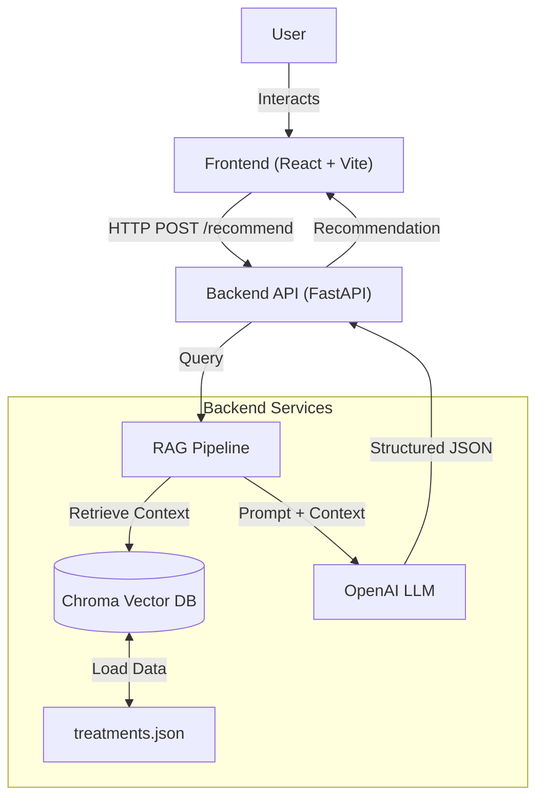
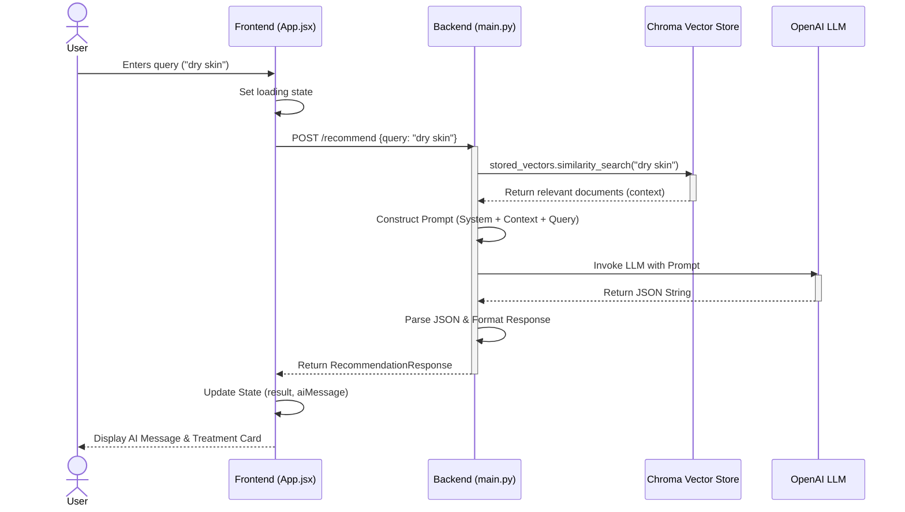

# System Design Document - Uncover

## 1. High-Level Architecture

The Uncover application is a full-stack web application designed to provide AI-powered skincare and hair restoration treatment recommendations. It utilizes a Retrieval-Augmented Generation (RAG) architecture to ground AI responses in a specific knowledge base of clinical treatments.

### Architecture Diagram



### Core Components

1.  **Frontend (Client)**: A React application built with React Vite and Tailwind CSS. It provides a modern, responsive user interface for users to input their concerns and view recommendations.
2.  **Backend (Server)**: A FastAPI application that serves as the orchestration layer. It handles API requests, manages the RAG pipeline, and communicates with the vector database and LLM.
3.  **Knowledge Base**: A local JSON file (`treatments.json`) containing structured data about treatments, concerns, and benefits. This data is indexed into a vector database.
4.  **Vector Database**: ChromaDB is used to store embeddings of the treatment data for semantic similarity search.
5.  **LLM (Large Language Model)**: OpenAI's GPT model is used to generate natural language responses and structure the output into JSON based on the retrieved context.

---

## 2. Low-Level Design

### 2.1 Frontend Architecture

-   **Framework**: React 18 with Vite.
-   **Styling**: Tailwind CSS for utility-first styling, Framer Motion for animations.
-   **State Management**: React `useState` for handling user input, loading states, and API responses.
-   **Component Structure**:
    -   `App.jsx`: Main container, handles the search logic and displays results.
    -   `PrescriptionCard.jsx`: Reusable component to display structured treatment details (Treatment name, targeting, benefits).
    -   `components/`: Directory for granular UI components.

#### Frontend Data Flow
1.  User types a query into the input field.
2.  `handleSearch` function is triggered on form submission.
3.  Application enters a loading state (displaying skeletons/spinners).
4.  `fetch` request is sent to `POST /recommend`.
5.  On success, `recommendation_text` is displayed as a chat message, and `related_treatments` are rendered using `PrescriptionCard` if available.
6.  On error, a graceful error message is shown.

### 2.2 Backend Architecture

-   **Framework**: FastAPI.
-   **Lifespan Management**:
    -   On startup (`lifespan`), the application loads `treatments.json`.
    -   It creates `Document` objects from the JSON data.
    -   It initializes `OpenAIEmbeddings` and creates/loads a `Chroma` vector store.
    -   A `retriever` is configured to find the top 3 most relevant documents.

-   **API Endpoints**:
    -   `GET /`: Health check.
    -   `POST /recommend`: Main business logic endpoint.

#### RAG Pipeline Flow (Inside `/recommend`)
1.  **Input**: Receives `RecommendationRequest` (user query).
2.  **Retrieval**: The `retriever` searches the ChromaDB for documents similar to the user's query.
3.  **Augmentation**:
    -   Retrieved documents are formatted into a single string.
    -   A `ChatPromptTemplate` constructs a prompt including the user's query and the retrieved context.
    -   Dependencies: `langchain`, `langchain-openai`.
4.  **Generation**:
    -   The prompt is sent to `ChatOpenAI`.
    -   The model is instructed to output strict JSON.
    -   A `JsonOutputParser` ensures the response is a valid Python dictionary.
5.  **Response**:
    -   If the LLM refuses (off-topic), an empty treatment list is returned.
    -   If successful, the JSON is mapped to `RecommendationResponse` (Pydantic model) and sent back to the client.

### 2.3 Data Model

#### Treatment Data Source (`treatments.json`)
Structure typically includes:
-   `treatment`: Name of the procedure.
-   `concern`: Issues addressed.
-   `benefit`: Outcomes.
-   `page_content`: (Optional) combined text for indexing.

#### API Models (Pydantic)
-   **Request**: `{ "query": "string" }`
-   **Response**:
    ```json
    {
      "recommendation_text": "string",
      "related_treatments": [
        {
          "treatment": "string",
          "concern": "string",
          "benefit": "string",
          "technology": "string"
        }
      ]
    }
    ```

---

## 3. Detailed Sequence Diagram

The following diagram illustrates the sequence of operations for a single recommendation request.


